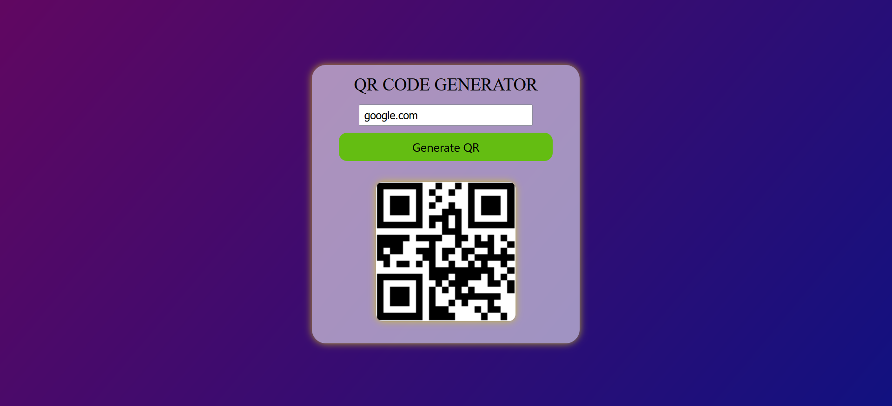
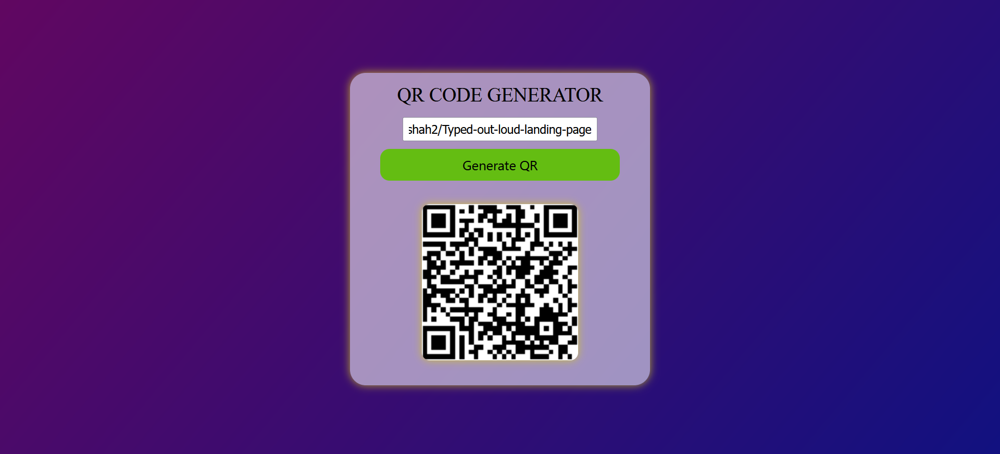
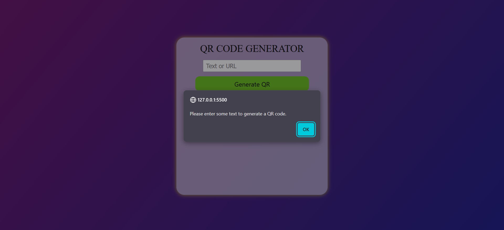

# 📱 QR Code Generator

This is a simple **QR Code Generator Web App** built using **HTML**, **CSS**, and **JavaScript**. Users can enter text or a URL, click a button, and instantly get a QR code that can be scanned.

---

## 🚀 Features

- 🔤 Converts any text or URL into a QR code
- 🎨 Stylish and responsive UI
- ⚠️ Shows alert if the input is empty
- 💡 Border/shadow appears only when QR code is generated

---

## 🛠️ Tech Stack

- **HTML5**
- **CSS3**
- **JavaScript (Vanilla)**
- **[QRServer API](https://goqr.me/api/)** – for generating the QR codes

---

## 📸 Screenshot

---

## 📂 Project Structure
QR-Code-Generator/
│
├── 📁 images/
│   └── screenshot.png         # Screenshot for README
│
├── 📁 css/
│   └── style.css                  # All CSS styles
│
├── 📁 js/
│   └── script.js                  # JavaScript logic
│
├── index.html                     # Main HTML file
└── README.md                      # Project documentation

---

## 📄 License

This project is open-source and free to use.
